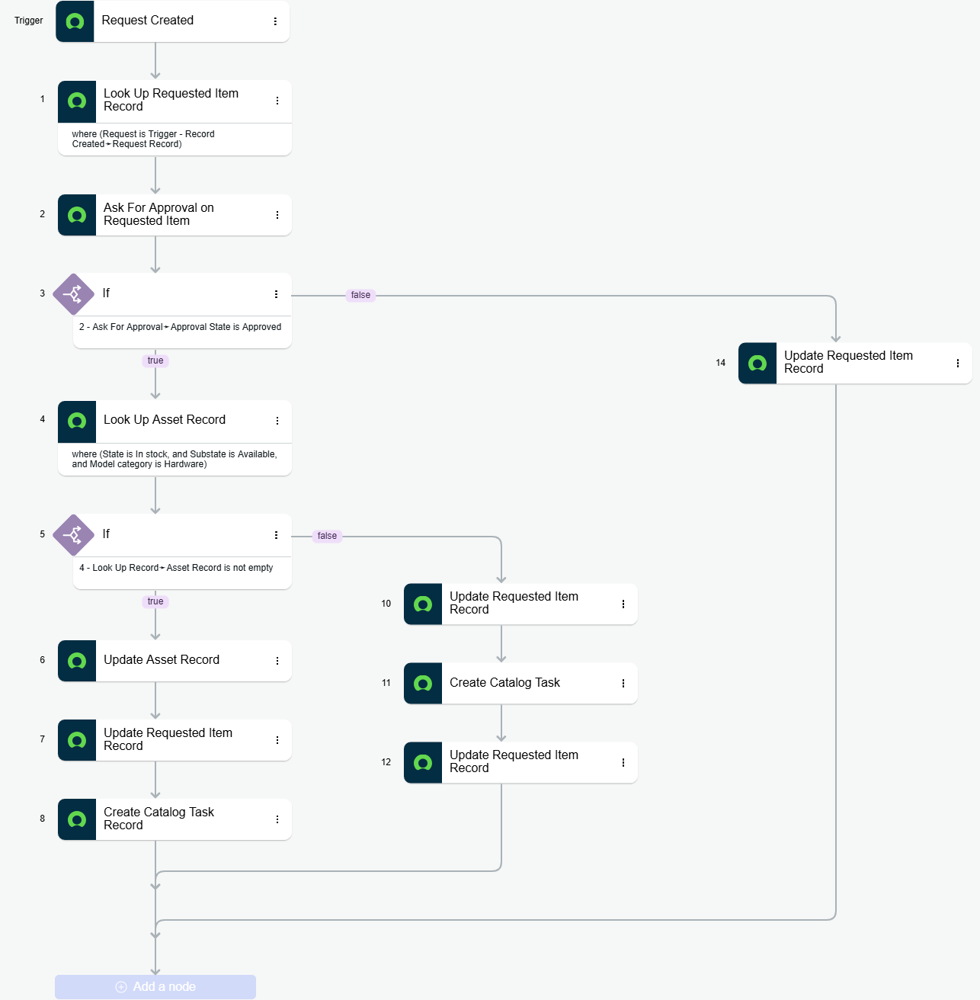

#  Asset Auto Allocation & SLA Tracking (ServiceNow)

## Project Overview

This project demonstrates an **end-to-end ServiceNow solution** for automating asset allocation using Flow Designer, integrating approval workflows, SLA tracking, and real-time dashboard visualization.

The system ensures that requested assets are automatically allocated based on availability, while tracking SLA performance and breaches for operational efficiency.

---

## Problem Statement

In many organizations:

* Asset allocation is manual and time-consuming
* Approvals delay request fulfillment
* No clear visibility into SLA performance
* SLA breaches are not proactively tracked

This project solves these problems by:

* Automating asset allocation
* Introducing approval workflows
* Tracking SLA lifecycle
* Providing a visual dashboard for monitoring

---

## Architecture Overview

### Core Components:

* **Service Catalog (RITM)** → Request creation
* **Flow Designer** → Automation logic
* **SLA Definition (task_sla)** → Time tracking & breach logic
* **Dashboard (Platform Analytics)** → Visualization layer

---

## Key Features

### 1. Asset Auto Allocation Flow

* Trigger: Record Created (Requested Item - `sc_req_item`)
* Steps:

  1. Lookup Requested Item
  2. Ask for Approval
  3. If Approved:

     * Lookup available asset (state = in stock)
     * Update asset status (allocated)
     * Update RITM
     * Create Catalog Task
  4. If Rejected:

     * Update RITM accordingly

---

### 2. Approval Workflow

* Dynamic approval assignment (e.g., Requested For / Admin)
* Supports:

  * Approve
  * Reject
* Drives flow branching logic

---

### 3. SLA Configuration

* SLA Name: **Asset Allocation SLA**
* Table: `sc_req_item`
* Duration: Configurable (e.g., 1 minute for demo)
* Conditions:

  * Start: Active = true
  * Stop: State = Closed Complete
* Tracks:

  * Business elapsed time
  * Time left
  * Breach status

---

### 4. SLA Breach Handling

* SLA breaches identified using:

  ```text
  has_breached = true
  ```
* Demonstrates:

  * Real-time countdown
  * Breach after duration expiry
  * SLA engine dependency

---

### 5. Dashboard (Platform Analytics)

#### Widgets Included:

*  SLA Status Overview (Pie Chart)
*  Active SLA Tracking (List)
*  SLA Trend (Bar Chart)
*  Breached SLAs (Filtered List)

#### Filters Applied:

```text
SLA definition = Asset Allocation SLA
Task table = sc_req_item
Has breached = true
```

---

##  Screenshots

###  Flow Designer



### SLA Definition


### RITM with SLA


### Dashboard


---


## 🔧 Setup Instructions

### 1. Import Update Set

* Navigate to: **System Update Sets → Retrieved Update Sets**
* Import XML file
* Preview → Commit

---

### 2. Activate Flow

* Go to **Flow Designer**
* Open *Asset Auto Allocation*
* Click **Activate**

---

### 3. Verify SLA

* Navigate to **SLA Definitions**
* Ensure:

  * Active = true
  * Correct table (`sc_req_item`)

---

### 4. Test the Flow

* Create a new Service Catalog Request
* Approve request
* Observe:

  * Asset allocation
  * SLA attachment
  * Task creation

---

### 5. View Dashboard

* Go to **Platform Analytics → Dashboards**
* Open: *Asset SLA Dashboard*

---

##  Testing Scenarios

| Scenario          | Expected Result                |
| ----------------- | ------------------------------ |
| Approval Approved | Asset allocated + task created |
| Approval Rejected | Flow stops / RITM updated      |
| SLA within time   | Status = In Progress           |
| SLA exceeded      | Status = Breached              |

---

##  Known Behavior

* SLA breach is not instant
* Depends on SLA Engine (Scheduled Jobs)
* Manual trigger may be required for immediate updates

---

##  Future Enhancements

* Dynamic approver assignment (based on role/group)
* Real-time SLA updates (reduce delay)
* Advanced dashboard filters (date/user-wise)
* Email notifications for SLA breach
* Integration with CMDB for smarter asset matching

---

##  Key Learnings

* `task_sla` is a global table → requires filtering
* SLA breach is controlled by background jobs
* Flow Designer + SLA = powerful automation combo
* Dashboards require clean data filtering for accuracy

---

## 👨‍💻 Author

**Uday Sagar Uppara**
ServiceNow Developer (Fresher)
Specializing in ITSM, Flow Designer & SLA Management

---

## ⭐ Final Note

This project demonstrates a **real-world enterprise use case** combining:

* Automation
* Approval workflows
* SLA tracking
* Analytics dashboards

👉 Designed to showcase practical ServiceNow development skills.

---
